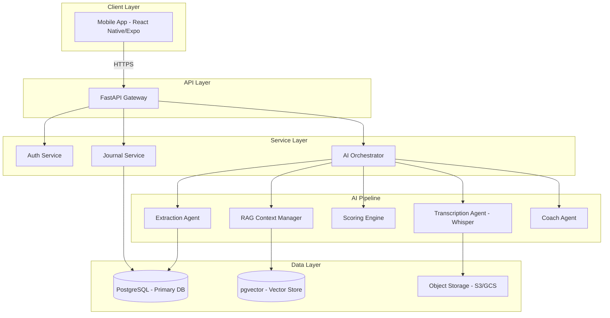
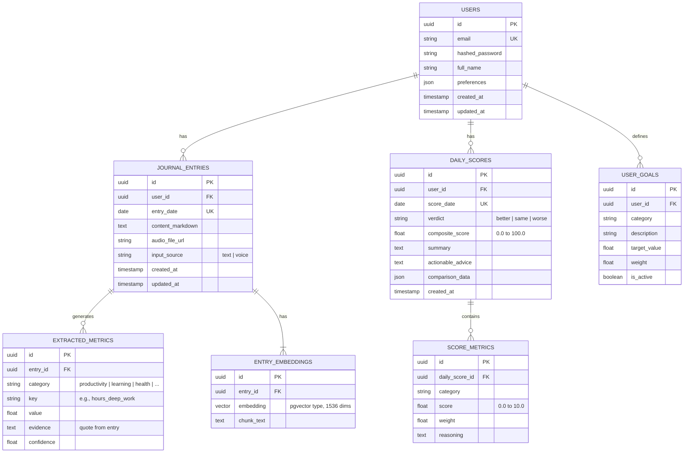
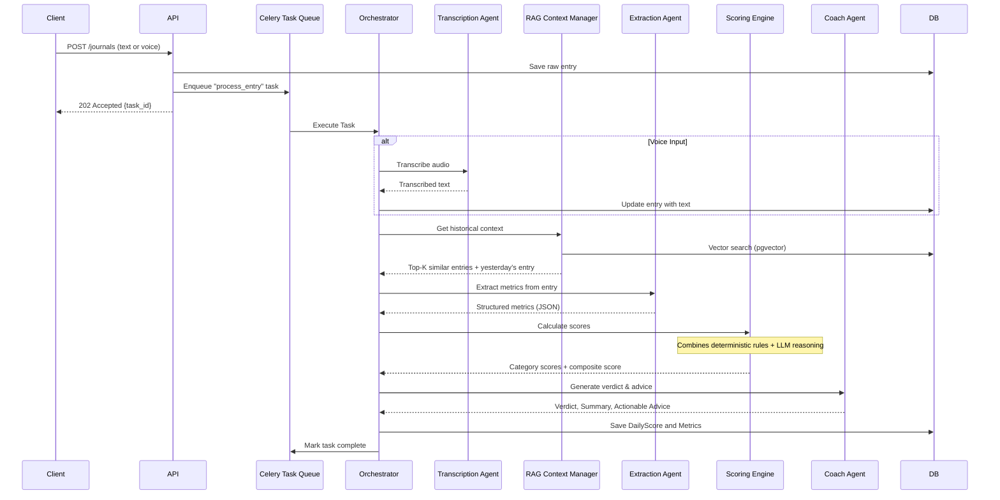

# Implementation Plan: "Am I Better Than Yesterday?" (AIBTY)

A comprehensive, AI-driven personal growth application.

---

## 1. Executive Summary

This document provides an exhaustive technical blueprint for "Am I Better Than Yesterday?" (AIBTY). It details the system architecture, data models, API specifications, AI pipeline, and mobile application structure required to build a production-ready application.

---

## 2. System Architecture

### 2.1 High-Level Architecture Diagram



### 2.2 Technology Stack

| Layer             | Technology                                  | Rationale                                                                 |
| :---------------- | :------------------------------------------ | :------------------------------------------------------------------------ |
| **Mobile**        | React Native (Expo SDK 52+)                 | Single codebase for iOS/Android; robust ecosystem.                        |
| **Backend API**   | Python 3.12, FastAPI                        | Async support, Pydantic validation, excellent for AI/ML integration.      |
| **AI Framework**  | LangChain, Instructor                       | Orchestration for LLM calls; structured output parsing.                   |
| **LLM**           | Claude 3.5 Sonnet (Anthropic)               | Best-in-class reasoning for nuanced text analysis.                        |
| **Embeddings**    | OpenAI `text-embedding-3-small`             | Cost-effective, high-performance embedding model.                         |
| **Transcription** | OpenAI Whisper API                          | Industry-leading accuracy for voice-to-text.                              |
| **Primary DB**    | PostgreSQL 16                               | Robust, reliable, supports complex queries.                               |
| **Vector DB**     | pgvector extension                          | Seamless integration with PostgreSQL; simplifies infrastructure.          |
| **Object Storage**| AWS S3 / Google Cloud Storage               | Scalable storage for audio files.                                         |
| **Caching**       | Redis                                       | Session management, rate limiting, caching frequent queries.              |
| **Task Queue**    | Celery with Redis Broker                    | Async processing for the AI pipeline.                                     |

---

## 3. Backend: Detailed Design

### 3.1 Project Directory Structure

```
backend/
├── alembic/                     # Database migrations
│   └── versions/
├── app/
│   ├── __init__.py
│   ├── main.py                  # FastAPI app entry point
│   ├── config.py                # Settings management (Pydantic)
│   ├── deps.py                  # Dependency Injection (DB sessions, auth)
│   │
│   ├── api/                     # API Routers
│   │   ├── __init__.py
│   │   ├── v1/
│   │   │   ├── __init__.py
│   │   │   ├── router.py        # Main v1 router aggregator
│   │   │   ├── auth.py          # /auth endpoints
│   │   │   ├── users.py         # /users endpoints
│   │   │   ├── journals.py      # /journals endpoints
│   │   │   ├── scores.py        # /scores endpoints
│   │   │   └── insights.py      # /insights endpoints
│   │
│   ├── core/                    # Core business logic
│   │   ├── __init__.py
│   │   ├── security.py          # JWT, password hashing
│   │   └── exceptions.py        # Custom exception handlers
│   │
│   ├── db/                      # Database setup
│   │   ├── __init__.py
│   │   ├── session.py           # Async SQLAlchemy engine/session
│   │   └── base.py              # Base model class
│   │
│   ├── models/                  # SQLAlchemy ORM Models
│   │   ├── __init__.py
│   │   ├── user.py
│   │   ├── journal_entry.py
│   │   ├── daily_score.py
│   │   ├── metric.py
│   │   └── embedding.py
│   │
│   ├── schemas/                 # Pydantic Schemas (DTOs)
│   │   ├── __init__.py
│   │   ├── user.py
│   │   ├── journal.py
│   │   ├── score.py
│   │   └── common.py
│   │
│   ├── services/                # Business Logic Services
│   │   ├── __init__.py
│   │   ├── user_service.py
│   │   ├── journal_service.py
│   │   └── score_service.py
│   │
│   └── ai_pipeline/             # The AI Orchestration Layer
│       ├── __init__.py
│       ├── orchestrator.py      # Main coordinator
│       ├── agents/
│       │   ├── __init__.py
│       │   ├── transcription_agent.py
│       │   ├── extraction_agent.py
│       │   ├── scoring_agent.py
│       │   └── coach_agent.py
│       ├── rag/
│       │   ├── __init__.py
│       │   ├── embedder.py
│       │   └── retriever.py
│       └── prompts/
│           ├── extraction.md
│           ├── scoring.md
│           └── coaching.md
│
├── tests/
├── pyproject.toml               # Poetry dependency management
├── Dockerfile
└── docker-compose.yml
```

### 3.2 Database Schema (ERD)



### 3.3 API Endpoint Specification

#### 3.3.1 Authentication (`/api/v1/auth`)

| Method | Endpoint         | Description                     | Request Body                        | Response                     |
| :----- | :--------------- | :------------------------------ | :---------------------------------- | :--------------------------- |
| POST   | `/register`      | Create a new user account.      | `{email, password, full_name}`      | `201 Created`, `UserRead`    |
| POST   | `/login`         | Authenticate and get JWT.       | `{email, password}` (Form Data)     | `200 OK`, `{access_token}`   |
| POST   | `/refresh`       | Refresh access token.           | `{refresh_token}`                   | `200 OK`, `{access_token}`   |
| GET    | `/me`            | Get current user profile.       | -                                   | `200 OK`, `UserRead`         |

#### 3.3.2 Journaling (`/api/v1/journals`)

| Method | Endpoint              | Description                                    | Request Body / Params                   | Response                        |
| :----- | :-------------------- | :--------------------------------------------- | :-------------------------------------- | :------------------------------ |
| POST   | `/`                   | Create or update a journal entry for a date.   | `{entry_date, content_markdown}`        | `201 Created`, `JournalRead`    |
| POST   | `/voice`              | Upload voice memo for a date.                  | `multipart/form-data: {entry_date, file}` | `202 Accepted`, `{task_id}`     |
| GET    | `/`                   | List journal entries (paginated).              | `?from_date=&to_date=&page=&limit=`     | `200 OK`, `List[JournalRead]`   |
| GET    | `/{entry_date}`       | Get a specific journal entry by date.          | Path param: `entry_date (YYYY-MM-DD)`   | `200 OK`, `JournalRead`         |
| PUT    | `/{entry_date}`       | Update an existing journal entry.              | `{content_markdown}`                    | `200 OK`, `JournalRead`         |
| DELETE | `/{entry_date}`       | Delete a journal entry.                        | Path param: `entry_date`                | `204 No Content`                |

#### 3.3.3 Scores & Insights (`/api/v1/scores`)

| Method | Endpoint              | Description                                     | Request Body / Params                   | Response                        |
| :----- | :-------------------- | :---------------------------------------------- | :-------------------------------------- | :------------------------------ |
| POST   | `/evaluate/{date}`    | Trigger AI evaluation for a specific date.      | Path param: `date (YYYY-MM-DD)`         | `202 Accepted`, `{task_id}`     |
| GET    | `/status/{task_id}`   | Check the status of an async evaluation.        | Path param: `task_id`                   | `200 OK`, `{status, result}`    |
| GET    | `/{date}`             | Get the daily score for a specific date.        | Path param: `date (YYYY-MM-DD)`         | `200 OK`, `DailyScoreRead`      |
| GET    | `/history`            | Get score history for a date range.             | `?from_date=&to_date=`                  | `200 OK`, `List[DailyScoreRead]`|
| GET    | `/trends`             | Get aggregated trends and analytics.            | `?period=week|month|quarter`            | `200 OK`, `TrendsResponse`      |

#### 3.3.4 User Goals (`/api/v1/goals`)

| Method | Endpoint      | Description                   | Request Body                              | Response                  |
| :----- | :------------ | :---------------------------- | :---------------------------------------- | :------------------------ |
| GET    | `/`           | List all user goals.          | -                                         | `200 OK`, `List[GoalRead]`|
| POST   | `/`           | Create a new goal.            | `{category, description, target, weight}` | `201 Created`, `GoalRead` |
| PUT    | `/{goal_id}`  | Update an existing goal.      | `{description?, target?, weight?}`        | `200 OK`, `GoalRead`      |
| DELETE | `/{goal_id}`  | Delete a goal.                | -                                         | `204 No Content`          |

---

## 4. AI Pipeline: Detailed Design

### 4.1 Orchestration Flow

The AI pipeline is an async, multi-stage process triggered after a journal entry is submitted.



### 4.2 Agent Specifications

#### 4.2.1 Transcription Agent
-   **Input**: Audio file URL (mp3, m4a, wav).
-   **Process**: Call OpenAI Whisper API (`whisper-1` model).
-   **Output**: Transcribed text string.

#### 4.2.2 Extraction Agent
-   **Input**: Journal entry text (markdown), User's defined goals/categories.
-   **Process**: LLM call (Claude 3.5 Sonnet) with a structured output prompt (using `Instructor` library for Pydantic model parsing).
-   **Output**: A list of `ExtractedMetric` objects.

**Prompt Strategy (`prompts/extraction.md`)**:
```markdown
You are an expert behavioral analyst. Your task is to extract quantifiable
metrics from a user's daily journal entry.

**User Goals (for context):**
{user_goals}

**Journal Entry:**
```
{journal_content}
```

**Instructions:**
1. For each relevant category, extract a specific metric.
2. For each metric, provide:
   - `category`: One of [productivity, learning, health, mental_well_being, discipline, creativity, social].
   - `key`: A specific, lowercase, snake_case key (e.g., "hours_of_deep_work").
   - `value`: The numeric value. Use estimation if not explicit.
   - `evidence`: A direct quote from the entry supporting this metric.
   - `confidence`: Your confidence in this extraction (0.0 to 1.0).

Respond ONLY with a valid JSON array.
```

#### 4.2.3 Scoring Engine (Hybrid Logic)
-   **Input**: Extracted metrics for today, historical metrics (from RAG), user goal weights.
-   **Process**:
    1.  **Deterministic Scoring**: Map raw metric values to a 0-10 scale per category based on predefined rules (e.g., `>= 4 hours deep work = 8.0 points in Productivity`).
    2.  **LLM Adjustment**: For subjective categories like `mental_well_being`, an LLM call refines the score based on sentiment and context.
    3.  **Composite Calculation**: `composite_score = sum(category_score * category_weight) / sum(weights)`.
-   **Output**: `List[ScoreMetric]`, `composite_score (float)`.

#### 4.2.4 RAG Context Manager
-   **Embedding**: On entry save, chunk the text and generate embeddings using OpenAI `text-embedding-3-small`.
-   **Retrieval**: On evaluation, query pgvector for:
    1.  Yesterday's entry (exact date match).
    2.  Top 5 semantically similar past entries.
    3.  The user's best and worst scoring days for comparison.
-   **Output**: A context bundle for the Scoring Engine and Coach Agent.

#### 4.2.5 Coach Agent
-   **Input**: Today's entry, today's scores, historical context from RAG, the verdict.
-   **Process**: LLM call (Claude 3.5 Sonnet) to synthesize a user-friendly summary.
-   **Output**:
    -   `verdict`: "better" | "same" | "worse"
    -   `summary`: A 2-3 sentence narrative of the day.
    -   `actionable_advice`: A bulleted list of 1-3 specific, concrete next steps.

**Prompt Strategy (`prompts/coaching.md`)**:
```markdown
You are a supportive, insightful personal growth coach.

**Today's Journal Entry:**
{today_entry}

**Today's Scores (0-10 scale):**
{scores_json}

**Yesterday's Scores:**
{yesterday_scores_json}

**User's 7-Day Average:**
{seven_day_avg_json}

**Verdict:** {verdict}

**Instructions:**
Based on the data above, provide:
1. `summary`: A brief, empathetic summary of the user's day, acknowledging wins and challenges. Keep it to 2-3 sentences.
2. `actionable_advice`: 1 to 3 specific, actionable recommendations for tomorrow. Be concrete, not generic. Example: "Try a 25-minute Pomodoro session before checking email."

Respond in JSON format.
```

---

## 5. Mobile Application: Detailed Design

### 5.1 Project Directory Structure

```
mobile/
├── app/                         # Expo Router file-based routing
│   ├── (auth)/                  # Auth routes (login, register) - unprotected
│   │   ├── _layout.tsx
│   │   ├── login.tsx
│   │   └── register.tsx
│   ├── (tabs)/                  # Main app tabs - protected
│   │   ├── _layout.tsx
│   │   ├── index.tsx            # Dashboard / Home
│   │   ├── journal.tsx          # Daily Journaling Screen
│   │   ├── history.tsx          # Calendar History View
│   ├── settings.tsx             # User Settings & Goals
│   └── _layout.tsx              # Root layout (providers)
│
├── components/                  # Reusable UI Components
│   ├── ui/                      # Primitive components (Button, Card, Input)
│   ├── VerdictCard.tsx
│   ├── ScoreChart.tsx
│   ├── JournalEditor.tsx
│   └── VoiceRecorder.tsx
│
├── lib/                         # Utilities & Config
│   ├── api.ts                   # Axios/Fetch client setup
│   ├── queryClient.ts           # React Query setup
│   └── storage.ts               # MMKV local storage helper
│
├── hooks/                       # Custom React Hooks
│   ├── useAuth.ts
│   ├── useJournals.ts
│   └── useScores.ts
│
├── providers/                   # Context Providers
│   └── AuthProvider.tsx
│
├── types/                       # TypeScript interfaces
│   └── index.ts
│
├── app.json                     # Expo configuration
├── package.json
└── tsconfig.json
```

### 5.2 Screen Specifications

#### 5.2.1 Dashboard (`app/(tabs)/index.tsx`)
-   **Purpose**: Show the user's current standing at a glance.
-   **Components**:
    -   `VerdictCard`: Large, prominent display of "Better ✓", "Same →", or "Worse ↓" with color coding (green, yellow, red).
    -   `CompositeScoreGauge`: A circular gauge showing today's composite score (0-100).
    -   `CategoryScoresList`: A horizontal scrollable list of each category's score (small circular indicators).
    -   `WeeklyTrendChart`: A simple line graph showing the last 7 days' composite scores.
    -   `ActionableAdviceCard`: Displays the 1-3 tips from the Coach Agent.

#### 5.2.2 Journal (`app/(tabs)/journal.tsx`)
-   **Purpose**: Input daily reflection.
-   **Components**:
    -   `DatePicker`: Defaults to "Today", allows selecting past dates.
    -   `JournalEditor`: A rich-text (Markdown) editor component. Supports basic formatting (bold, italic, lists).
    -   `VoiceRecorder`: A floating action button (FAB). Tap to record, tap again to stop. Displays recording duration. Sends audio to backend.
    -   `SaveButton`: Submits the entry. Triggers the evaluation pipeline on the backend.
    -   `OfflineIndicator`: A banner if the device is offline. Entry is saved locally and synced later.

#### 5.2.3 History (`app/(tabs)/history.tsx`)
-   **Purpose**: Review past entries and scores.
-   **Components**:
    -   `CalendarView`: A monthly calendar component (e.g., `react-native-calendars`). Each day is colored based on its verdict.
    -   `DayDetailModal`: On tap of a date, a bottom sheet slides up showing:
        -   The journal entry for that day.
        -   The score breakdown.
        -   The AI-generated summary.

#### 5.2.4 Settings (`app/settings.tsx`)
-   **Purpose**: User preferences and goal management.
-   **Components**:
    -   `ProfileSection`: Edit name, email.
    -   `GoalsList`: CRUD interface for user goals. Each goal has a category dropdown, a description field, a target value, and a weight slider.
    -   `NotificationSettings`: Toggle for daily journaling reminders.
    -   `LogoutButton`.

### 5.3 Offline-First Strategy
1.  **Local Storage**: Use `react-native-mmkv` for high-performance key-value storage. Store draft entries locally before syncing.
2.  **Sync Queue**: Maintain a queue of pending API calls. When the device comes back online, process the queue in order.
3.  **Optimistic UI**: Show the entry as "saved" immediately, with a background sync indicator.
4.  **Conflict Resolution**: "Last write wins" strategy. If an entry is modified on two devices, the most recent `updated_at` timestamp prevails.

---

## 6. Verification Plan

### 6.1 Automated Testing

| Layer    | Tool              | Scope                                   |
| :------- | :---------------- | :-------------------------------------- |
| Backend  | `pytest`          | Unit tests for services, agents.        |
| Backend  | `pytest + httpx`  | Integration tests for all API endpoints.|
| Backend  | `pytest-asyncio`  | Async test runner for FastAPI.          |
| Mobile   | `jest`            | Unit tests for hooks and utils.         |
| Mobile   | `React Native Testing Library` | Component tests.         |
| E2E      | `Maestro`         | End-to-end mobile UI tests.             |

### 6.2 Manual Verification Checkpoints

-   [ ] User can register and log in successfully.
-   [ ] User can submit a text journal entry and see it saved.
-   [ ] User can record a voice memo and see it transcribed.
-   [ ] AI evaluation runs and produces a valid `DailyScore`.
-   [ ] Dashboard correctly displays the verdict and scores.
-   [ ] History screen shows past entries with correct color-coding.
-   [ ] Offline journaling works: entry saves locally and syncs when online.
-   [ ] User can define custom goals, and they influence scoring.

---

## 7. Implementation Phases & Timeline

| Phase | Milestone                         | Key Deliverables                                             | Est. Duration |
| :---- | :-------------------------------- | :----------------------------------------------------------- | :------------ |
| 1     | **Backend Foundation**            | FastAPI project, Auth, DB schema, basic CRUD for journals.   | 2 weeks       |
| 2     | **AI Core**                       | Extraction Agent, Scoring Engine, basic Coach Agent.         | 3 weeks       |
| 3     | **RAG & Memory**                  | pgvector setup, Embedding pipeline, Retrieval logic.         | 2 weeks       |
| 4     | **Mobile Shell**                  | Expo project, Auth screens, Navigation, basic Journal screen.| 2 weeks       |
| 5     | **Mobile Integration**            | Connect to API, Dashboard, History, Voice recording.         | 3 weeks       |
| 6     | **Polish & QA**                   | UI refinement, Offline sync, Error handling, Testing.        | 2 weeks       |
| **Total** |                               |                                                              | **~14 weeks** |

---
